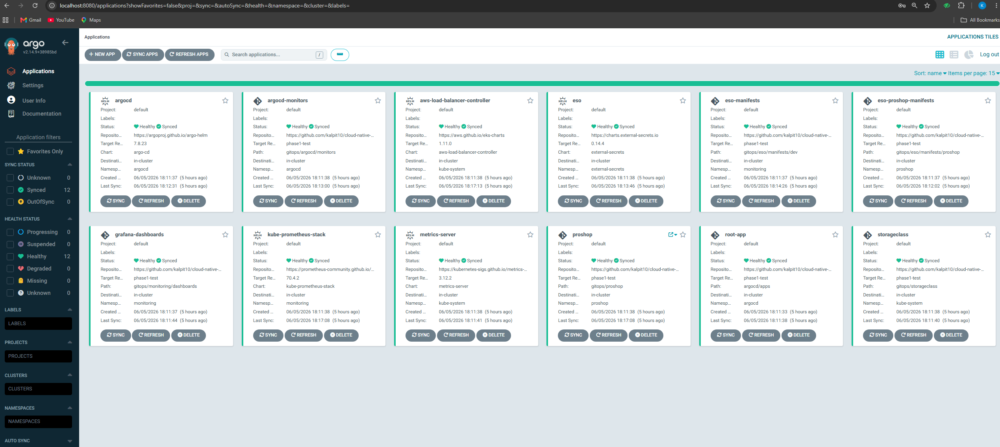
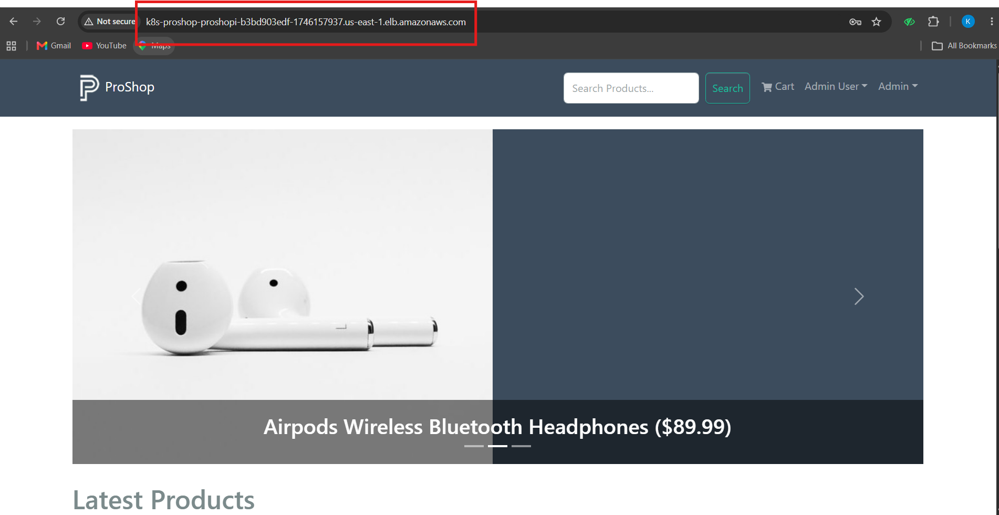
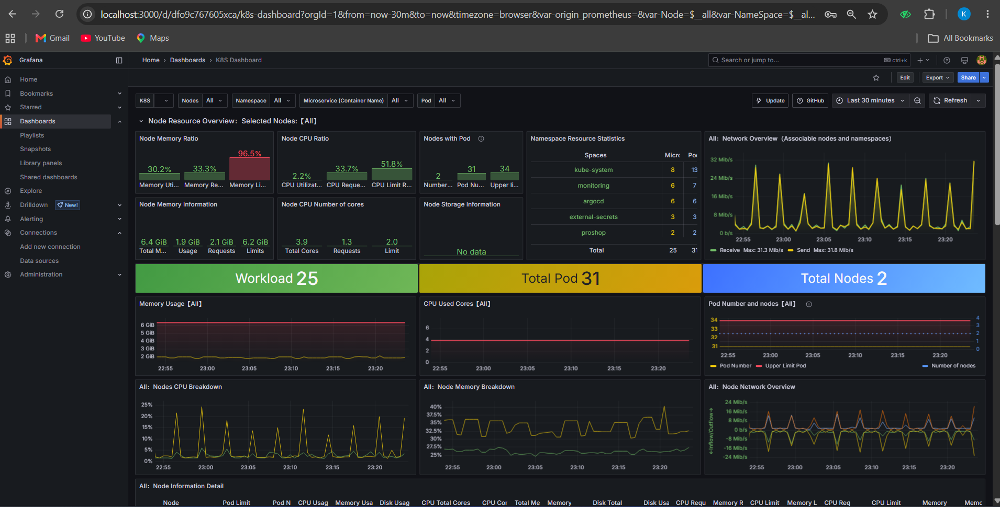
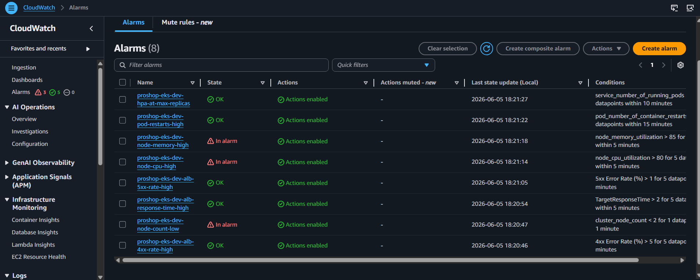
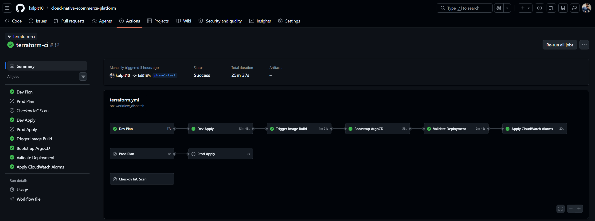
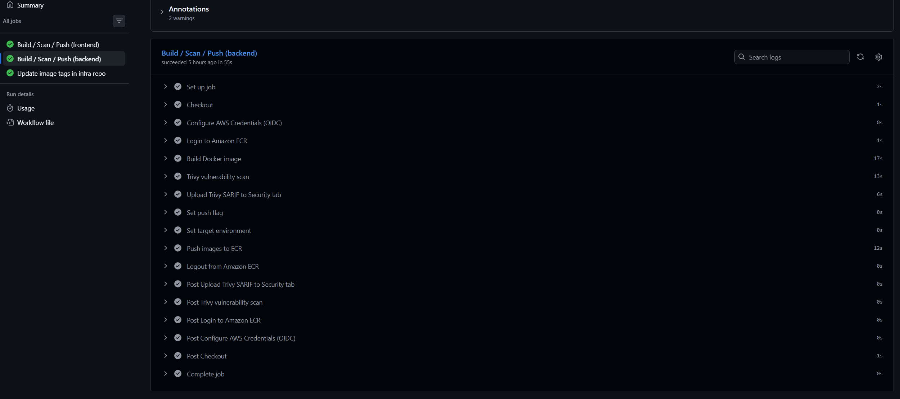

# Fully Automated EKS GitOps Platform on AWS

A production-style deployment of the ProShop v2 MERN e-commerce application on AWS Elastic
Kubernetes Service, built with GitOps, automated CI/CD pipelines, secrets management,
container security scanning, and full-stack observability. Every architectural decision
in this project has a documented reason behind it.

---

## Architecture


The platform separates three independent concerns: Terraform provisions AWS infrastructure,
ArgoCD manages all Kubernetes workloads via GitOps, and GitHub Actions handles image builds
and pipeline orchestration. These three layers never overlap. A change in application code
does not touch infrastructure state. A change in infrastructure does not redeploy application
pods.

**Application:** ProShop v2, a full-featured MERN e-commerce store with product listings,
user authentication, shopping cart, and PayPal payment integration.

- **Frontend:** React served via Nginx
- **Backend:** Node.js and Express REST API
- **Database:** MongoDB Atlas (external managed database)
- **Payments:** PayPal Sandbox API

---

## Tech Stack

| Layer                      | Tool                         | Version           | Purpose                                              |
| -------------------------- | ---------------------------- | ----------------- | ---------------------------------------------------- |
| Infrastructure as Code     | Terraform                    | 1.12.2            | Provisions all AWS resources                         |
| Container Orchestration    | Amazon EKS                   | 1.35              | Managed Kubernetes cluster                           |
| GitOps                     | ArgoCD                       | 7.8.23 (Helm)     | Deploys and reconciles all Kubernetes workloads      |
| Secret Sync                | External Secrets Operator    | Latest stable     | Syncs AWS Secrets Manager into Kubernetes at runtime |
| Container Registry         | Amazon ECR                   | -                 | Stores frontend and backend Docker images            |
| Ingress and Load Balancing | AWS Load Balancer Controller | Latest stable     | Creates and manages ALB from Kubernetes Ingress      |
| Pod Autoscaling Metrics    | Metrics Server               | Latest stable     | Provides CPU and memory metrics for HPA              |
| Monitoring Stack           | kube-prometheus-stack        | Latest stable     | Prometheus, Grafana, and Alertmanager                |
| Persistent Storage         | EBS CSI Driver               | EKS managed addon | gp3 persistent volumes for Prometheus metrics        |
| CI/CD                      | GitHub Actions               | -                 | Image builds, scanning, and pipeline orchestration   |
| Container Scanning         | Trivy                        | SHA-pinned        | Scans built images for CVEs before ECR push          |
| IaC Scanning               | Checkov                      | Latest stable     | Scans Terraform and Kubernetes manifests on PRs      |
| State Locking              | S3 native locking            | Terraform 1.11+   | Replaces deprecated DynamoDB locking                 |
| Private Networking         | VPC Interface Endpoints      | -                 | Keeps AWS service traffic off the public internet    |
| Alerting                   | CloudWatch Alarms and SNS    | -                 | Email alerts on cluster and application thresholds   |

---

## Why GitOps

In a traditional pipeline, `kubectl apply` runs inside CI/CD. Deployment state lives inside
the pipeline, not in a repository. There is no single source of truth. Drift between what
is running and what is in Git is invisible until something breaks. Rollback means re-running
a pipeline with an older tag.

ArgoCD flips this. The Git repository is the source of truth. ArgoCD continuously compares
what is declared in Git against what is running in the cluster. If they differ, ArgoCD
corrects the drift. Every deployment is a Git commit with an author, a timestamp, and a
diff. Rollback is a `git revert`. Nothing runs in the cluster that is not declared in Git.

---

## Screenshots

**ArgoCD App of Apps: all applications Synced and Healthy**



**ProShop application running via ALB DNS**



**Grafana: live cluster metrics**



**CloudWatch Alarms: tuned thresholds with real firing**



**GitHub Actions: full automated standup pipeline**



**Trivy scan passing in webapp CI pipeline**



---

## Cost Estimate: Development Environment (us-east-1, June 2026)

> All prices reflect us-east-1 (N. Virginia), the most cost-efficient AWS region.
> Prices in other regions are higher: EU regions run 5 to 15 percent more, Asia Pacific
> 25 to 40 percent more, and South America up to 2x more. If you are deploying in a
> different region, recalculate using the AWS Pricing Calculator before committing.

> This project is designed to be destroyed between working sessions to control cost.
> A running cluster with all components costs approximately $15 to $20 per day.
> Destroying and redeploying takes roughly 20 minutes and is fully automated.

| Component                         | Configuration                                                                | Unit Price          | Monthly Cost |
| --------------------------------- | ---------------------------------------------------------------------------- | ------------------- | ------------ |
| EKS Control Plane                 | 1 cluster, 730 hours                                                         | $0.10/hr            | $73.00       |
| Worker Nodes (EC2 t3.medium)      | 2 nodes x 730 hrs (desired), up to 3 max                                     | $0.0418/hr per node | $61.03       |
| NAT Gateway (hourly)              | 1 gateway, 730 hours                                                         | $0.045/hr           | $32.85       |
| NAT Gateway (data processing)     | Estimate 50 GB/month outbound to MongoDB Atlas                               | $0.045/GB           | $2.25        |
| Application Load Balancer         | 1 ALB, 730 hours                                                             | $0.0225/hr          | $16.43       |
| ALB LCU charges                   | Low traffic estimate                                                         | $0.008/LCU-hr       | ~$3.00       |
| VPC Interface Endpoints           | 5 endpoints (ECR API, ECR DKR, Secrets Manager, STS, CloudWatch Logs), 2 AZs | $0.01/hr per AZ     | $73.00       |
| EBS gp3 Volumes (Prometheus)      | 2 volumes at 20 GB each (Prometheus + Alertmanager)                          | $0.08/GB-month      | $3.20        |
| EBS gp3 Volumes (Node root disks) | 2 nodes x 20 GB default root volume                                          | $0.08/GB-month      | $3.20        |
| Amazon ECR Storage                | 2 repos, estimate 5 GB stored images                                         | $0.10/GB-month      | $0.50        |
| CloudWatch Logs Ingestion         | Container Insights and control plane logs, estimate 5 GB/month               | $0.50/GB ingested   | $2.50        |
| CloudWatch Logs Storage           | 7-day retention, low volume                                                  | $0.03/GB-month      | $0.50        |
| CloudWatch Alarms                 | 8 alarms                                                                     | $0.10/alarm-month   | $0.80        |
| SNS Email Notifications           | Low volume                                                                   | Effectively free    | $0.00        |
| S3 State Storage                  | Terraform state, versioning enabled                                          | Negligible          | $0.05        |
| **Estimated Monthly Total**       |                                                                              |                     | **~$272.31** |

**Key cost note on VPC endpoints:** Five interface endpoints across two AZs cost approximately
$73 per month. This is the largest non-compute line item. The tradeoff is that all ECR image
pulls, Secrets Manager reads, STS token exchanges, and CloudWatch log writes travel entirely
within the AWS private network rather than through the NAT Gateway. Without these endpoints,
the same traffic would generate NAT Gateway data processing charges at $0.045 per GB. For
container-heavy workloads pulling large images frequently, endpoints typically pay for
themselves. For this project at low traffic volumes, the cost is roughly equivalent.

**What is not included in this estimate:**

- MongoDB Atlas (separate billing, free tier available for development)
- Data transfer out to the internet beyond the first 100 GB/month free tier
- Cross-AZ data transfer at $0.01 per GB each direction
- CloudWatch detailed monitoring beyond basic metrics
- EKS extended support charges: keep Kubernetes version current to avoid the $0.60/hr
  extended support rate, which is 6x the standard $0.10/hr rate

---

## Cost Estimate: Production Environment (us-east-1, June 2026)

> Production uses larger nodes, a second NAT Gateway for HA, higher log retention,
> and more ECR storage for image history.

| Component                         | Configuration                                 | Unit Price            | Monthly Cost |
| --------------------------------- | --------------------------------------------- | --------------------- | ------------ |
| EKS Control Plane                 | 1 cluster, 730 hours                          | $0.10/hr              | $73.00       |
| Worker Nodes (EC2 t3.large)       | 3 nodes x 730 hrs (desired), up to 5 max      | $0.0832/hr per node   | $182.21      |
| NAT Gateway (hourly)              | 2 gateways across 2 AZs for HA                | $0.045/hr per gateway | $65.70       |
| NAT Gateway (data processing)     | Higher outbound traffic estimate 150 GB/month | $0.045/GB             | $6.75        |
| Application Load Balancer         | 1 ALB, 730 hours                              | $0.0225/hr            | $16.43       |
| ALB LCU charges                   | Moderate traffic estimate                     | $0.008/LCU-hr         | ~$10.00      |
| VPC Interface Endpoints           | 5 endpoints, 2 AZs                            | $0.01/hr per AZ       | $73.00       |
| EBS gp3 Volumes (Prometheus)      | 2 volumes at 50 GB each                       | $0.08/GB-month        | $8.00        |
| EBS gp3 Volumes (Node root disks) | 3 nodes x 20 GB default root volume           | $0.08/GB-month        | $4.80        |
| Amazon ECR Storage                | 4 repos (prod images), estimate 15 GB         | $0.10/GB-month        | $1.50        |
| CloudWatch Logs Ingestion         | Higher volume, estimate 20 GB/month           | $0.50/GB ingested     | $10.00       |
| CloudWatch Logs Storage           | 30-day retention                              | $0.03/GB-month        | $2.00        |
| CloudWatch Alarms                 | 8 alarms                                      | $0.10/alarm-month     | $0.80        |
| SNS Notifications                 | Low to moderate volume                        | Negligible            | $0.10        |
| S3 State Storage                  | Terraform state, versioning enabled           | Negligible            | $0.05        |
| **Estimated Monthly Total**       |                                               |                       | **~$454.34** |

> These are estimates based on always-on operation. Actual costs depend on traffic volume,
> HPA scaling behavior, log ingestion rates, and data transfer patterns. Validate against
> your real usage using AWS Cost Explorer after the first month of operation.

---

## Security Decisions

| Decision                     | What was done                                                              | Why                                                                                                                                                                                                                                                    |
| ---------------------------- | -------------------------------------------------------------------------- | ------------------------------------------------------------------------------------------------------------------------------------------------------------------------------------------------------------------------------------------------------ |
| OIDC authentication in CI/CD | GitHub Actions exchanges a signed JWT for temporary AWS credentials        | No static AWS access keys stored anywhere. Keys cannot be leaked because they do not exist                                                                                                                                                             |
| IRSA for pod AWS access      | Each pod service account maps to a specific IAM role via OIDC              | Pods only get the AWS permissions they need. No node-level IAM role gives blanket access to all pods                                                                                                                                                   |
| External Secrets Operator    | Secrets synced from AWS Secrets Manager into Kubernetes at runtime         | Secret values never appear in Terraform state, Git, or Docker images                                                                                                                                                                                   |
| SHA-pinned GitHub Actions    | Every third-party Action is pinned to a full 40-character commit SHA       | Git tags are mutable and can be repointed to malicious code. A commit SHA cannot be changed. This decision was made directly in response to the March 2026 Trivy supply chain attack where mutable tags were exploited across over 10,000 repositories |
| Trivy container scanning     | Built images scanned for CVEs before any ECR push                          | A clean codebase can still ship with a vulnerable base image. Trivy catches OS-level and dependency CVEs in the final built artifact. Blocks on CRITICAL severity only to avoid false positives from unfixable base image vulnerabilities              |
| Checkov IaC scanning         | Terraform and Kubernetes manifests scanned on every PR                     | Catches misconfigurations before they reach the cluster. Different problem than Trivy: Trivy scans runtime containers, Checkov scans configuration files                                                                                               |
| Private EKS worker nodes     | All nodes in private subnets with no public IPs                            | Nodes are not directly reachable from the internet. Only the ALB is publicly accessible                                                                                                                                                                |
| VPC Interface Endpoints      | ECR, Secrets Manager, STS, and CloudWatch traffic stays on private network | AWS API calls from pods never leave the AWS network. Eliminates a class of risk for sensitive traffic                                                                                                                                                  |
| Immutable ECR tags in prod   | Production ECR repositories set to IMMUTABLE                               | An existing image tag cannot be overwritten. A specific tag always refers to the same image that was tested and approved                                                                                                                               |
| S3 native state locking      | `use_lockfile = true` replaces DynamoDB locking                            | DynamoDB locking was deprecated in Terraform 1.11. S3 native locking uses conditional writes at the S3 API level, eliminates a separate AWS dependency, and simplifies stuck-lock recovery                                                             |

---

## Repository Structure

```
cloud-native-ecommerce-platform/
|-- .github/
|   `-- workflows/
|       |-- terraform.yml        # Terraform CI/CD with full standup sequence
|       `-- teardown.yml         # Automated environment teardown pipeline
|-- argocd/
|   |-- apps/                    # Child ArgoCD Application manifests
|   `-- bootstrap/               # Root app bootstrap manifest
|-- gitops/
|   |-- argocd/                  # ArgoCD self-management values
|   |-- eso/                     # External Secrets Operator config
|   |   `-- manifests/
|   |       |-- dev/             # ClusterSecretStore and ExternalSecrets for dev
|   |       `-- prod/            # ClusterSecretStore and ExternalSecrets for prod
|   |-- lbc/                     # AWS Load Balancer Controller values
|   |-- monitoring/              # kube-prometheus-stack values and dashboards
|   |-- proshop/                 # Application manifests (deployments, services, ingress, HPA)
|   `-- storageclass/            # gp3 StorageClass manifest
|-- infra/
|   `-- envs/
|       |-- dev/                 # Dev environment Terraform root
|       `-- prod/                # Prod environment Terraform root
|-- modules/
|   |-- vpc/                     # VPC, subnets, NAT Gateway, VPC endpoints
|   |-- eks/                     # EKS cluster, node groups, IAM, OIDC, addons
|   |-- ecr/                     # ECR repositories with lifecycle policies
|   `-- cloudwatch/              # CloudWatch dashboard and alarms
`-- .checkov.yaml                # Checkov scan configuration
```

> **Note:** All Kubernetes manifest files in the `gitops/` and `argocd/` directories
> currently point to the `phase1-test` branch as the ArgoCD target revision. If you
> are running this project from the `main` branch after the final merge, update all
> `targetRevision: phase1-test` references in the ArgoCD Application manifests to
> `targetRevision: main` before deploying.

---

## Prerequisites: Manual Setup Required

Before running any pipeline, create these resources manually. Everything else
is fully automated.

### 1. S3 Bucket for Terraform State

Create one S3 bucket per environment with versioning enabled and public access blocked.

```
capstone-tfstate-<account-id>-use1
```

Terraform uses this bucket as the remote state backend with S3 native locking
(`use_lockfile = true`). No DynamoDB table is required. DynamoDB locking was
deprecated in Terraform 1.11.

### 2. AWS Secrets Manager Secrets

Create the following secret manually in AWS Secrets Manager:

**Secret name:** `proshop/backend`

**Required keys:**

```
MONGO_URI                    MongoDB Atlas connection string
JWT_SECRET                   Secret key for JWT token signing
PAYPAL_CLIENT_ID             PayPal sandbox application client ID
PAYPAL_APP_SECRET            PayPal sandbox application secret
PAYPAL_API_URL               PayPal API base URL
PORT                         Backend server port (5000)
NODE_ENV                     production or development
PAGINATION_LIMIT             Number of products per page (8)
grafana_username             Grafana admin username
grafana_password             Grafana admin password
alertmanager_smtp_username   SMTP username for Alertmanager email alerts
alertmanager_smtp_password   SMTP password for Alertmanager email alerts
```

All application secrets, Grafana credentials, and Alertmanager SMTP credentials
live in this single secret. The External Secrets Operator syncs them into Kubernetes
at runtime. Nothing sensitive appears in this repository.

### 3. GitHub Secrets

Configure the following secrets in both repositories under Settings, Secrets and
Variables, Actions:

**In cloud-native-ecommerce-platform (infra repo):**

| Secret                 | Value                                                    |
| ---------------------- | -------------------------------------------------------- |
| `AWS_ROLE_TO_ASSUME`   | ARN of the GitHub Actions OIDC IAM role                  |
| `AWS_REGION`           | `us-east-1`                                              |
| `WEBAPP_TRIGGER_TOKEN` | Fine-grained PAT with `actions:write` on Capstone-WebApp |

**In Capstone-WebApp (webapp repo):**

| Secret               | Value                                                                     |
| -------------------- | ------------------------------------------------------------------------- |
| `AWS_ROLE_TO_ASSUME` | ARN of the GitHub Actions OIDC IAM role                                   |
| `AWS_REGION`         | `us-east-1`                                                               |
| `INFRA_REPO_TOKEN`   | Fine-grained PAT with `contents:write` on cloud-native-ecommerce-platform |

### 4. GitHub OIDC Trust in AWS

Create an IAM OIDC identity provider for `token.actions.githubusercontent.com` in
your AWS account. Create an IAM role that trusts this provider and attach the
permissions your pipelines need. No static access keys are used anywhere in this
project.

### 5. GitHub Environments

Create the following GitHub Environments in the infra repo under Settings,
Environments:

- `dev`: used by the Terraform apply job, add required reviewers if desired
- `prod`: used by the Terraform prod apply job, required reviewers recommended
- `destroy-gate`: used by the teardown pipeline, always require a named approver

---

## CI/CD Pipeline Overview

### Webapp Pipeline (Capstone-WebApp repository)

Triggered on push to main, pull request to main, or manual `workflow_dispatch` with
environment selection.

```
Push or dispatch
  Build Docker images for frontend and backend
  Trivy CVE scan on each built image
    CRITICAL CVEs found: pipeline fails, no push to ECR
    No CRITICAL CVEs: continue
  Push to ECR with commit SHA tag
    Dev: SHA tag and latest tag
    Prod: SHA tag only (latest tag is not pushed to production)
  Commit updated image tag back to infra repo gitops/proshop/ manifests
  ArgoCD detects the new commit and auto-syncs dev environment
```

### Infra Pipeline (cloud-native-ecommerce-platform repository)

**On pull request:** Checkov IaC scan, Terraform fmt check, Terraform validate,
Terraform plan for dev and prod.

**On merge to main:** Terraform apply gated by GitHub Environment manual approval.

**On workflow dispatch: full automated standup**

```
Terraform apply
  Creates VPC, subnets, NAT Gateway, VPC endpoints
  Creates EKS cluster with t3.medium worker nodes
  Creates ECR repositories
  Creates IAM roles, OIDC provider, IRSA bindings
  Installs EBS CSI Driver and CloudWatch Observability addons

Webapp pipeline triggered automatically
  Builds frontend and backend Docker images
  Trivy scans both images
  Pushes images to ECR with commit SHA tag
  Updates image tags in gitops/proshop/ manifests

ArgoCD bootstrap
  Installs ArgoCD via Helm (version 7.8.23)
  Applies root-app manifest
  ArgoCD syncs all child applications in wave order

Validation
  Waits for all 10 ArgoCD apps to show Synced and Healthy
  Outputs the ALB DNS URL to the workflow summary

CloudWatch alarms applied
  Targeted terraform apply after ALB exists
  All 8 alarms created with SNS email notifications
```

**After the pipeline completes:**

The ALB DNS URL appears in the GitHub Actions workflow summary. Open that URL in
a browser to access the ProShop storefront.

---

## Connecting to the Cluster Locally

Once the CI/CD pipeline completes and you want to verify the cluster from your
local terminal, follow these steps in order.

**Step 1: Re-add your IAM user as a cluster admin**

Each time the infrastructure is destroyed and redeployed, the EKS cluster is
brand new. Your local kubeconfig still holds credentials from the previous cluster.
You need to create a fresh access entry for your IAM user on the new cluster before
`kubectl` will work.

```bash
aws eks create-access-entry \
  --cluster-name proshop-eks-dev \
  --principal-arn arn:aws:iam::<account-id>:user/<iam-username> \
  --region us-east-1

aws eks associate-access-policy \
  --cluster-name proshop-eks-dev \
  --principal-arn arn:aws:iam::<account-id>:user/<iam-username> \
  --policy-arn arn:aws:eks::aws:cluster-access-policy/AmazonEKSClusterAdminPolicy \
  --access-scope type=cluster \
  --region us-east-1
```

Replace `<account-id>` with your AWS account ID and `<iam-username>` with the
IAM user name you use locally with the AWS CLI.

**Step 2: Update your local kubeconfig**

```bash
aws eks update-kubeconfig --name proshop-eks-dev --region us-east-1
```

**Step 3: Verify the cluster**

```bash
kubectl get pods -n proshop
```

**Additional verification commands:**

```bash
# Check all nodes are Ready
kubectl get nodes -o wide

# Check all pods across all namespaces
kubectl get pods --all-namespaces

# Check ArgoCD application status
kubectl get applications -n argocd

# Get the ALB URL
kubectl get ingress -n proshop

# Check backend logs
kubectl logs -n proshop -l app=backend --tail=50

# Check frontend logs
kubectl logs -n proshop -l app=frontend --tail=50

# Check External Secrets sync status
kubectl get externalsecrets -n proshop
kubectl get externalsecrets -n monitoring

# Check HPA status
kubectl get hpa -n proshop

# Check PVC status (Prometheus persistent volumes)
kubectl get pvc -n monitoring
```

**Access internal tools via port-forward:**

```bash
# ArgoCD UI
kubectl port-forward svc/argocd-server -n argocd 8080:80
# Open http://localhost:8080

# Grafana
kubectl port-forward svc/kube-prometheus-stack-grafana -n monitoring 3000:80
# Open http://localhost:3000

# Prometheus
kubectl port-forward svc/kube-prometheus-stack-prometheus -n monitoring 9090:9090
# Open http://localhost:9090
```

---

## ArgoCD App of Apps

ArgoCD uses the App of Apps pattern. A single root Application watches the
`argocd/apps/` directory in this repository. Any file added to that directory
automatically becomes a managed application. This means adding a new platform
component requires only one manifest file. No Helm commands, no `kubectl apply`
in a pipeline.

**Deployment order (ArgoCD sync waves):**

| Wave   | Applications                                                                                              |
| ------ | --------------------------------------------------------------------------------------------------------- |
| First  | External Secrets Operator, AWS Load Balancer Controller, Metrics Server, gp3 StorageClass                 |
| Second | kube-prometheus-stack, ESO Manifests (creates backend-secrets and grafana-secret)                         |
| Third  | ProShop application (ExternalSecret at wave -1, Deployments at wave 1, HPAs at wave 2, Ingress at wave 3) |

Every ArgoCD Application manifest includes the cascade deletion finalizer
(`resources-finalizer.argocd.argoproj.io`). Deleting the root Application cascades
deletion to all child Applications, which cascades to all Kubernetes resources, which
triggers the Load Balancer Controller to delete the ALB and the EBS CSI Driver to
release persistent volumes. This is what makes automated teardown reliable.

**Sync policy:**

- Development: auto-sync with self-healing and pruning enabled
- Production: manual sync required in ArgoCD UI before any deployment

---

## Observability

### Prometheus and Grafana

The kube-prometheus-stack deploys Prometheus, Grafana, and Alertmanager into the
`monitoring` namespace. Prometheus metrics persist across pod restarts using a gp3
EBS volume. Grafana admin credentials are synced from AWS Secrets Manager via ESO
and never appear in Git.

**Grafana dashboards deployed automatically via ConfigMap sidecar:**

- Node Exporter Full (dashboard 1860): node-level CPU, memory, disk, and network
- Kubernetes Views Global (dashboard 15661): cluster-wide pod and resource overview
- ArgoCD Application Overview (dashboard 19974): GitOps sync status and application health

### CloudWatch Alarms

Eight CloudWatch Alarms are provisioned by Terraform and send email notifications via SNS.

| Alarm                    | Threshold                             | Why this threshold                                                                                        |
| ------------------------ | ------------------------------------- | --------------------------------------------------------------------------------------------------------- |
| Node CPU utilization     | Above 80% for 5 minutes               | Sustained high CPU indicates a workload spike or node sizing issue before pods are evicted                |
| Node memory utilization  | Above 85% for 5 minutes               | Memory pressure above 85% risks the OOM killer terminating pods                                           |
| Node count               | Below 2 nodes ready                   | A node failure reduces cluster capacity. Two is the minimum for any redundancy                            |
| Pod restart count        | More than 5 restarts in 15 minutes    | Occasional restarts are normal. Five in fifteen minutes indicates a crash loop                            |
| HPA at maximum replicas  | Sustained for 10 minutes              | HPA at max means the application cannot scale further. Traffic demand exceeds cluster capacity            |
| ALB 5xx error rate       | Above 1% of requests for 5 minutes    | Errors reaching users. One percent is a meaningful signal without generating noise from isolated failures |
| ALB 4xx error rate       | Above 5% of requests for 5 minutes    | High 4xx rates often indicate a bad deployment, misconfigured routing, or auth issues                     |
| ALB target response time | Above 2 seconds average for 5 minutes | Two seconds is the threshold where users start abandoning page loads                                      |

---

## Teardown: Automated Environment Destruction

The teardown pipeline handles full environment destruction in the correct order.
It deletes all Kubernetes resources first (including the ALB) before Terraform
touches the VPC.

**Why order matters:** The ALB is created by the AWS Load Balancer Controller
in response to the Kubernetes Ingress resource. Terraform has no record of this
ALB in its state. If `terraform destroy` runs first, it tries to delete the VPC
while the ALB is still attached to the subnets. AWS refuses and the destroy
fails. The teardown pipeline avoids this by deleting the ArgoCD root Application
first, which cascades deletion to the Ingress, which triggers the Load Balancer
Controller to delete the ALB, before Terraform ever touches the VPC.

**To run teardown:**

1. Go to the `cloud-native-ecommerce-platform` repository
2. Open the Actions tab
3. Select the `Teardown Environment` workflow
4. Click `Run workflow`
5. Select the environment (`dev` or `prod`)
6. Type `DESTROY` in the confirmation field (exactly, case-sensitive)
7. Click `Run workflow`
8. Approve the run in the `destroy-gate` GitHub Environment when prompted
   **What happens automatically:**

```
Disable ArgoCD auto-sync (prevents re-creation during cleanup)
Delete root ArgoCD Application (cascades to all child apps and Kubernetes resources)
Wait for ALB deletion to complete
terraform destroy -target=module.eks
terraform destroy -target=module.vpc
terraform destroy (remaining resources)
```

---

## Future Enhancements

These are enhancements that would make a meaningful difference for a production
e-commerce deployment. Each one has a specific reason behind it.

### HTTPS with TLS termination

The application currently runs on HTTP over port 80. For an e-commerce application
handling user authentication and payment flows, this is not acceptable in production.
The fix is cert-manager installed in the cluster to automate Let's Encrypt certificate
provisioning, combined with a Route 53 domain and an ALB listener on port 443 with
an ACM certificate. The Ingress annotations change from HTTP to HTTPS with an HTTP
to HTTPS redirect. This is the single highest-priority enhancement for any production
deployment.

### Custom domain with Route 53

The application currently uses an auto-generated ALB DNS name that changes on every
destroy and redeploy. A Route 53 Alias record pointing to the ALB gives a stable,
readable URL. For an e-commerce store, a stable URL is a basic requirement.
This also unlocks HTTPS as described above.

### Multi-AZ NAT Gateway in dev

Development currently runs a single NAT Gateway in one availability zone to reduce
cost. If a dev environment needs to more closely mirror production behavior for
testing, a second NAT Gateway in the second AZ removes a hidden single point of
failure for outbound traffic. The cost increases by approximately $33 per month.

### Horizontal cluster autoscaling with Karpenter

The current node group uses a fixed instance type (t3.medium in dev, t3.large in prod)
with min and max counts managed by the EKS managed node group. Karpenter replaces this
with intelligent node provisioning that selects the right instance type and size for the
actual workload being scheduled. For an e-commerce platform with variable traffic,
Karpenter would reduce node costs during low-traffic periods and provision capacity
faster during traffic spikes than the managed node group scale-out process. The
tradeoff is additional operational complexity in the cluster.

### Database connection pooling

The backend connects directly to MongoDB Atlas on every request without connection
pooling at the infrastructure layer. Under sustained load, the number of open
connections to Atlas grows with the number of backend pod replicas. A connection
pooling layer keeps Atlas connection counts predictable regardless of how many pods
are running.

### Canary deployments

The current deployment strategy is a rolling update. Kubernetes replaces old pods
with new pods gradually. For a production e-commerce store, a failed deployment
reaches 100 percent of users eventually. A canary strategy routes a small percentage
of traffic to the new version first, monitors error rates and response times, and
only promotes to full rollout if the metrics look healthy. Argo Rollouts adds this
capability to the existing ArgoCD setup with minimal configuration changes. The
reason to add this is simple: a bad deployment to a store that handles real payments
should affect as few users as possible for as short a time as possible.

### Distributed tracing

The current observability setup provides metrics via Prometheus and logs via
CloudWatch. What it cannot show is the path of a single request through the system,
such as how long the backend spent querying MongoDB, which specific API call was slow,
or where in the request chain a latency spike occurred. OpenTelemetry with Jaeger or
Tempo provides this. For debugging performance issues in a production e-commerce API,
distributed tracing is the difference between knowing that something is slow and
knowing exactly where and why.

---

## Related Repository

Application source code and webapp CI/CD pipeline:
[Capstone-WebApp](https://github.com/kalpit10/Capstone-WebApp)

---

## Contributing and Learning

Whether you are just starting out with cloud infrastructure or are an experienced
engineer looking to explore a full GitOps setup on AWS, this project is designed
to be readable and reproducible. Every decision has a reason documented either in
this README or in the code comments.

If you spot something that could be improved, whether it is a better architectural
pattern, a cost optimization, a security improvement, or a documentation gap, feel
free to open a pull request. Feedback from people with different perspectives and
experience levels is always welcome.

If you are using this project to learn, the best starting point is the Architecture
section at the top, followed by working through the Prerequisites and How to Deploy
steps in a fresh AWS account. The teardown pipeline makes it safe to experiment
without worrying about leaving expensive resources running.
